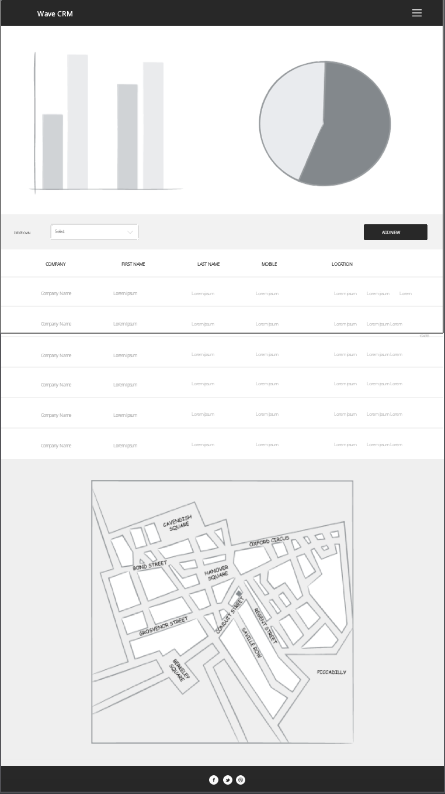

# Wave CRM

This single page application (SPA) serves as a very basic form of CRM for a popular accounting solution called Wave Accounting. The application comprises of 3 major sections graphs, table and map. Each section provides unique filtering options to the user. The desired effect of the application is to allow for greater visualisation of customer data in order to produce improved insights from the aforementioned visualisation. This application was built using only three major languages namely HTML5, CSS and JavaScript. Together with these languages various libraries and frameworks were used to build the application, all of which are detailed in the deployment section.

## UX

### Function
This project is for users of an online accounting solution called Wave Accounting, that require a basic form of CRM to better visualise and manage their customer information. Currently, no CRM exists that requests data from Wave Accounting and uses the data in a CRM application. The only other solution that exists is Zapier which acts as a universal API web service adapter. Zapier can be used to send customer information to any other connected application within the Zapier environment. This CRM application is easy to use and easy to set up as defined in the deployment section.

### Styling
This application was built using the front-end framework called Bootstrap using a custom Bootstrap based theme from [Bootswatch](https://bootswatch.com/), the theme used is called Flatly. This theme was selected as the contrasting colours of the dark blue and light grey backgrounds provide a sharp and clean look and feel to the application. That together with the pop of colour the orange accents used with the blues used in the [dc.js](https://dc-js.github.io/dc.js/) charts provide just the right amount of complimenting colours to the application.

The font used is from [Google Fonts](https://fonts.google.com/), called Montserrat. All headings are a bold 700 weight and all other text is the standard 400 font weight. Some additional styling used include the same orange mentioned above for links on hover and [Font Awesome](https://fontawesome.com/) icons were used for the footer social media icons.

### User Stories
- As a developer, I want to expand on the project, so that I can customise the project to my needs without starting from the beginning.
- As an employer/client, I want to hire a capable developer, so I can complete my project successfully.
- As a client, I want to buy a basic CRM application, so I can satisfy my CRM needs. 
- As a Wave user, I want to extend my accounting software capabilities, so I can gain better insights into my customers.
- As a Wave prospect, I want to see what additional services I can get if I use Wave, so I can rest assured that Wave plus additional serves will meet my needs.
- As a Wave product manager, I want to see how developers use our API, so I can get ideas for the Wave product roadmap.
- As a Wave developer, I want to see developers using our API, so I can justify expanding the API to include additional features.
- As a Code Institue Marker, I want to determine the student has achieved the learning outcomes so that I can score the level of achievement (out of 5).
- As a developer, I want to learn how other developers have implemented the Wave API, so I can better use the Wave API for my own projects.
- As another application developer, to build into appealing
- As another accounting solution provider, I want to find developers with API web service experience, so I can recruit them to build integrations into my platform.
- As a recruiter, I want to determine the prospects capabilities, so that I can place successful candidates.
- As a sales manager, I want to better understand my customers, so I can sell more products and services.
- As a business owner, I want to understand my business better, so I can grow my business sustainably.
- As a logistics manager, I want to optimise my delivery routes, so I can better serve my customers and save the business money.

### Page Sections

#### Loader
> This section consists of a full page loading screen that displays while the application fetches the customer data from the Wave API web service.

#### Header
> This section consists of a simple navigation menu with left aligned text for the application name and right aligned text with the application links to sections on the page.

#### Main

##### Graphs
> This section consists of two 50% width elements that hold the customer bar chart and pie chart. The bar chart displays customers created in each year. The pie chart displays customers grouped by their activity status.
    
##### Table
> This section displays a list of customers in a table with two additional options. Firstly left aligned is a select menu that allows the user to filter the data. This filter allows the user to display customer data based on whether the customer has a website. Secondly right aligned is a button that allows the user to create a new customer record.
    
##### Map
> This section displays the customer locations based off of their saved address from Wave Accounting. This allows the user to better visualise a correlation between customer addresses.

#### Modal
> This section displays when the add new button is clicked. The modal displays a form with some of the most important fields to create a new Wave Accounting customer.

#### Footer
> The footer has 3 elements, all centre aligned that are Font Awesome social media icons which are linked to the developers' relevant social media icons.

### Mockups
The project mockups are available below and in the mockups directory in mobile, tablet and desktop views:

#### Mobile

#### Tablet

#### Desktop

## Features
 
### Existing Features
- Responsiveness - allows the website to render in a user-friendly format on any device (mobile, tablet and desktop).
- Bar Chart - the dc.js bar chart displays customers created by year which is interactive, click a bar to filter the data by year.
- Pie Chart - the dc.js pie chart displays customers by their activity status, click the piece of the pie chart to filter by active or inactive.
- Table - the dc.js table displays customers in a table, on load by all and then filtered by each bar, pie charts or select menu if filtered. The # table column indicates the customer row number in the table which corresponds to the number used in the Google Map marker.
- Website select - the dc.js select menu allows the user to filter customer data based on whether they have a website or not.
- Google map - the google map geocodes customer address into longitude and latitude using the Google Geocoder API and places the markers on the map. Additionally, the marker colours have been customised to include white marker labels. Note, the geocode service passes an error when too many requests are made in quick succession. Therefore when working with large data sets make sure to batch requests in smaller groups.
- Popover - the popover is used after the map heading, surrounding a Font Awesome information icon that pops up a dialogue box to provide more information about the map when clicked.
- Wave API Query - this feature is executed on page load (body tag) to load the customer data from a GraphQl API using an XMLHTTP Request. This data is then used in all of the page sections through a cross-filter and Google map / Google Geocoder. Note, the authorisation token used for the Wave API is from a testing account, it is not a good idea to use this token in a JavaScript file as it is visible to all visitors, I would recommend using the token within the server-side code. Although the server-side code did not fall within the scope of this project hence my chosen application. 
- Wave API Mutation - this feature creates a new customer in Wave Accounting using an XMLHTTP Request to the Wave API which is managed through GraphQl. The customer information is entered through a modal form which is triggered by the add new button.
- Modal Pop-up - this feature is a standard structural element of Bootstrap. The form within the modal captures the data. Once save is clicked the form data is sent to Wave Accounting through an XMLHTTP Request but first, the query variables are prepared by saving the form data into a JavaScript object in a format that the API can successfully process.
- Loading screen - The loading screen executes on page load and once a successful response is received from the API call the loading screen fades out to hidden thereby displaying the index.html page in full. The loading screen displays at 100% of the page size height and width. With a loading gif to show the user, the application is processing. If the query fails an alert box pops-up which prompts the user to try again.

### Features Left to Implement
- Google map clustering - when map pins are closely grouped the map will group them together to show the total pins in the group. This improves the user-friendliness of the map when working with large sets of pins.
- Table pagination - this will only show a predefined number of customer records per page to streamline the page load time.
- Filtering options on table headers - the table headers can be filterable to order the records according to what the user desires.
- Google map user office location(s) can also be added to display the users' office location in relation to the customers' addresses.
- Google map routes can be used to calculate optimal delivery routes from the users' office location to the customers' address or multiple addresses.
- Additional graphs can be added using dc.js to filter on other customer information captured in Wave.
- As Wave develops further enhancements additional features can be added to the CRM like Invoice and product information.
- Additional optimisation can be made on making the application more streamline while working with large data sets as the current configuration is not likely to fair well with large volumes of data.
- A customer update function can be added to the table of customers loaded on the page so the user can update the customer details from the application.
- Additional customer fields can be made available in the table and modal to view and manage customers on additional information (e.g. shipping addresses).

## Technologies Used

### Languages
-    HTML / HTML5 - To display content on each HTML page and enable the use of more semantic elements used in HTML5.
-    CSS / CSS3 - To style content in each HTML page and enable additional styling features by using CSS3.
-    JavaScript - To make HTML content more dynamic and to enable features that are supported by Bootstrap, jQuery, popper, D3, DC, Crossfilter and Google Maps API.

### Libraries
-    Bootstrap - To speed up the building of the project using the front end framework that has been tied and tested.
-    Font Awesome - To make the project more visually appealing to users through the use of icons.
-    Google Fonts - To make enable custom fonts to be used in the project. Hind Vadodara and Mitr were selected.
-    jQuery - To simplify Dom manipulation and to enable Bootstrap features.
-    D3.js - to add requested data to the Dom to be manipulated by other JS libraries.
-    Dc.js - to render data in various formats such as graphs, tables and other useful formats.
-    Crossfilter - to use within the dc.js dimensions and groups, this makes specific data points easy to manipulate.
-    Google Maps API - to display the Google map and markers on the page.
-    Google Geocoder - to transform customer addresses to longitude and latitude to be used in the Google map.

## Testing
This project was tested using the Google Chrome Inspect tool. Using the aforementioned tool the website was tested using multiple screen sizes. These screen sizes include various mobile, tablet, and desktop sizes using both portrait and landscape views. The Jasmine automated testing tool was considered but proved unnecessary as very few functions return a specific result and are most functions are chained together.

The following checks were done to ensure the website is working as intended:
- All links working and directed correctly
- All styles applied and display correctly
- All icons displayed with the intended styling
- All navigation elements are working as intended
- All popovers are operating as intended
- Bar chart displaying and filtering correctly
- Pie chart displaying and filtering correctly
- Google map loading and markers displaying correctly
- Loading screen displaying and hiding correctly
- Modal form fields are all required with a submit button
- W3C validator HTML errors fixed
- W3C validator CSS errors fixed
- Google Dev Tools Audit run and fixed issues on each page
- JSHint errors and warnings fixed (for all that were necessary)

## Deployment

### Example Deployment
This project has been deployed on GitHub Pages using the following method:
- When in the overview page select the repository you would like to publish
- When in the appropriate repository, using the repository navigation bar select the settings option
- When in the settings screen scroll down to GitHub Pages heading and below the source, sub-heading select the branch you would like to deploy (in this case the master branch was used)
- Enter the name for your project and publish it (Milestone 2 project was used)
- Wait for the website deployment to be finalised by GitHub

> The deployed version is the latest version of the website

### Deploy for yourself

#### Online
To deploy this application on Github Pages, fork the repository and use the same deployment method as stipulated in the example deployment. To deploy this application on your own server do the following:
- In the home screen of the repository, folder select the download button and select zip option.
- Once downloaded unzip the file and upload it to the directory you would like the application to run on, on your server.
- Run the index.html file in the browser to see the application run.
- Once confirming the application is running correctly replace the security tokens to request customer data from your own Wave account.
- Troubleshooting - if the application is not working as expected make sure to check the console for errors and file paths.

#### Local
To deploy this application locally:
- In the home screen of the repository, folder select the download button and select zip option.
- Once downloaded unzip the file
- Then open the index.html file in your browser.
- Once confirming the application is running correctly replace the security tokens to request customer data from your own Wave account.
- Troubleshooting - if the application is not working as expected make sure to check the console for errors and file paths.

#### Online
- All dependencies will work as intended by making use of all the files within the repository.
- When upgrading the dependencies make sure to update the files in the libraries directory and the links within the index.html file.

## Contribute
Developer contributions are welcomed and encouraged.

To contribute just fork the GitHub repository and when ready create a push request with detailed notes of the changes which will be reviewed and added to the project on success.

Feel free to pick up any of the above-mentioned features left to implement.

## Credits

### Content
- The icons used in this project are from [FontAwesome](https://fontawesome.com/).
- Most elements of this website use [Bootstrap](https://getbootstrap.com/) elements.
- [Bootswatch](https://bootswatch.com/) was used to customise the Bootstrap colour palette.
- The fonts were selected from [Google Fonts](https://fonts.google.com/).
- The table and graphs are rendered by a combination of [D3](https://dc-js.github.io/dc.js/), [DC](https://d3js.org/) and [Crossfilter](https://square.github.io/crossfilter/).
- [Google Maps JavaScript API](https://developers.google.com/maps/documentation/javascript/tutorial) was used to render the map to the index.html page.

### Acknowledgements
- [Responsinator](http://www.responsinator.com/) was used to check mobile and tablet responsiveness.
- [Google Maps Geocoding Service](https://developers.google.com/maps/documentation/javascript/geocoding) was used to transform the customer addresses to longitude and latitude format.
- [Giphy](https://giphy.com/gifs/icon-loading-beaker-11FuEnXyGsXFba) was used to find a loading gif.